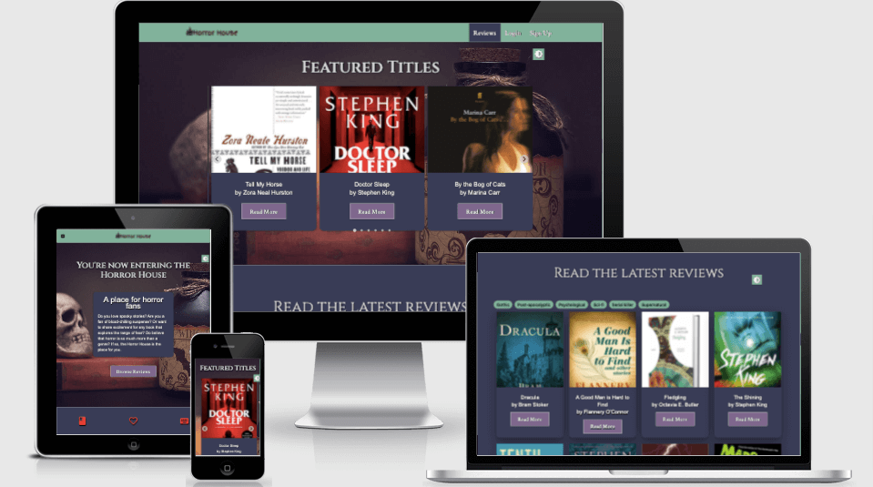
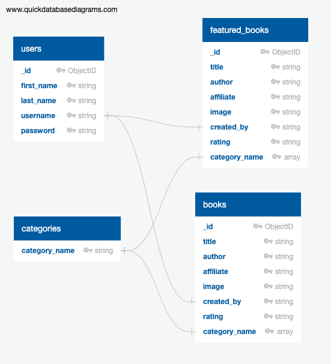
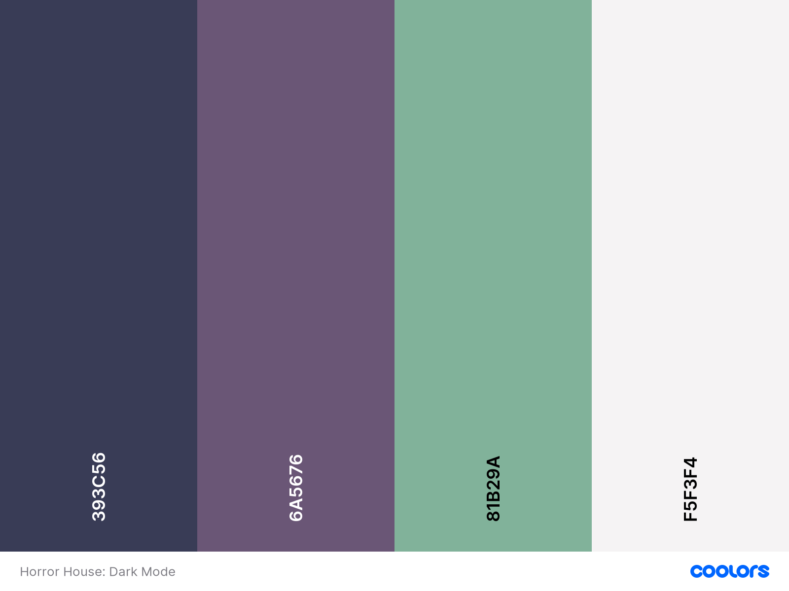
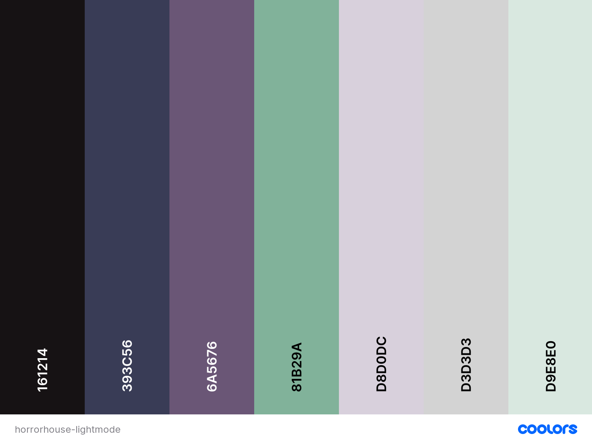

# Horror House Reviews: Milestone 3
  

## Live Site

View live deployed site [HERE](https://horror-house-reviews.herokuapp.com/)

From [Am I Responsive?](http://ami.responsivedesign.is/)

## About this project

  

Horror House reviews is a book review site for fans of horror novels, short stories, plays, or any form of literature. Fans of horror books can read reviews, sort the reviews by category, and access featured reviews created by superusers. Members can write their own reviews, rate the book, add categories to sort the books by subgenre, and add an external link to buy the book from a bookseller.

Members can also edit and update their reviews directly from their personal profile. Superusers can create featured reviews that link to affialiate links from Amazon so that these users get a commission for book referrals.

  

## Table of Contents

  

+  [Ux](#ux-planning)

    - [User Stories](#user-stories)
    - [Scope](#scope)
    - [Structure](#structure)
    - [Wireframes](#wireframes)
    - [Database](#database-structure)
    - [Design](#design-choices) 

+  [Features](#features)

+  [Technologies used](#technologies-used)

+  [Testing](#testing)

+  [Deployment](#deployment)

+  [Credits](#credits)

## UX Planning

  

### Project Goals:

 

  

+ Create a place for users to read reviews of books in the horror genre.

+ Allow uers to add and update the reviews they've created.

+ Sort books by subgenre categories for users to find books on a specific topic.

+ Allow superusers to create and edit featured reviews with affiliate links for Amazon.

*** 

### Research:

 

  

To research this project, I created accounts on book review sites so that I could test out the specific features I wanted to apply on my site. Here are the larger review sites:

  

[SF Book Reviews](https://sfbook.com/)

  

[Love Reading](https://www.lovereading.co.uk/)

  

[Good Reads](https://www.goodreads.com/)

  

The functionality and design of the site are also inspired by current sites that are specifically for horror book reviews:

  

[This is Horror](https://www.thisishorror.co.uk/category/reviews/)

  

[Sublime Horror](https://www.sublimehorror.com/)

  

[Horror Novel Reviews](https://horrornovelreviews.com/)

***

### User Stories:

 

  

#### Basic user

   

1. As a user, I want to be able to read reviews by other horror fans.

2. As a user, I want to create a personal account.

3. As a user, I want to be able to login to this account.

4. As a user, I want to create a review with a book image and link to buy the book.

5. As a user, I want to sort books by specific subgenres.

6. As a user, I want to rate the book using a star rating 1-5.

7. As a user, I want a personal profile where I can update my password.

8. As a user, I want a personal profile to update and delete reviews.

9. As a user who is neurodivergent, I want the option to switch between light and dark modes.

  

 

  

#### Superuser

 

1. As a superuser, I want the option to add and edit featured reviews to only appear on my profile or the profile of another superuser.

2. As a superuser, I want to add affiliate links from Amazon so that I can make money from my reviews.

3. As a superuser, I want to limit all form links on a site to only allow links with image extensions in the field to add a book image.

  
***  

### Scope
 

+ Create an accessible site that's easy to navigate and intuitive for all users, especially neurodivergent users.

+ Create a site that works on all devices and sizes responsively.

+ Provide a platform for users to easily read reviews, sort them, create their own account, and write/edit/delete their book reviews.

+ Allow superusers to add, edit, and delete featured reviews from their profile.

*** 

### Structure

   

This website allows users to access different parts of the site depending on if they're logged in/have an account. Users are also limited to parts of the site based on their permission status.

  

+ Guest users: can access the homepage, the main book review page, reviews of individual and featured books, and book category links. They can also create an account and see the option to login. Guest users can only login once they've created an account.

+ Registered users: can login to the site. Once logged in, these users can add a book review from a link in the main navigation. They can also access the profile page where they can edit and delete reviews.

+ Superusers: can create and edit featured reviews from a tab on their user profile.

***  

### Wireframes

All Wireframes for site pages are in [this pdf file](static/docs/horror-house-wireframes.pdf). 

As a note, I used the same wireframes to create all the add/edit forms. There are only minor design differences in three forms, so the same general design is used on the site.

 
  
***

### Database structure
 

  
***

### Design Choices
 
  

#### Colours
 
  

Horror House reviews was designed to put accessibility first. I'm interested in building and maintaining sites that have robust accessibility features. As a neurodiverse person with ADHD, I wanted to add dark mode as a feature on the site.

  

Users with ADHD and autism may have light sensitivity that can effect their vision, especially if they're staring at a screen for a long time.

  

There's some information on neurodiversity and light sensitivity in [this article](https://www.theraspecs.com/blog/adhd-light-sensitivity-hypersensitivity-sensory-processing/).

  

Users with autism respond best to 'soft, mild colors', according to [this article](https://livingautism.com/autism-friendly-digital-world/). In this case, I focused on soft purples and greens for main site areas and accents.

  

The dark mode primary theme colour is a deep blue/grey instead of black. This is to mitigate eye-strain that can be caused by the contrast with light font colours.

  

Note: For future versions of this site, I plan to switch the greens over to blue/blue-grey. Accessibility can be tricky to balance, and I understand now that green is not accessible for users with red/green colour blindness.

  

Dark Mode palette:

  

  

On the other hand, neurodiverse users with dyslexia prefer 'dark coloured text on a light (not white) background', following the tips from [this dyslexia support group](https://www.bdadyslexia.org.uk/advice/employers/creating-a-dyslexia-friendly-workplace/dyslexia-friendly-style-guide).

  

In this case, I created a light mode palette that can be toggled on/off. This toggle is fixed to the right on every page.

  

To build light mode styles, I used the dark mode colours as accents and applied lighter versions of these colours in most of the main site sections.

  

***  

### Fonts
 
  

The h1 and h2 headings are Cinzel, which I used to evoke a spooky feel for the horror theme of the site.

  

The navigation links and buttons are styled with Crimson Text to complement the style of Cinzel.

  

The main text areas with large blocks of text (paragraph text) are styled with Arial. I chose Arial because it's a sans-serif font that's easier to read for neurodiverse users.

  

Poppins is used to complement Arial's style for some smaller text areas.

  

The site fonts are set at larger sizes (1.2REM or higher) for ease of reading on all screen sizes.

***  

### Images

   

**Logo**
 
  

The site logo includes the brand name and a haunted house icon to fit with the site's design and horror theme.

  

**Background image**
 
  

To create consistency across all pages, I used the same parallax background image. I chose this image because of the spooky items: a bottle of potion, a skull, and a stack of books.

  

**Book images**
 
  

Each book has a book cover image that was sourced from Amazon.co.uk. This is so that users can more easily recognise and pick a book for which to read a review.

  

## Features
 

### Features available to all users
 

+ Light/Dark Mode Toggle

    - This toggle is available on all pages and devices. It is set to be sticky so that users can easily access it on any part of the page. It was built with a Materialze icon and card. It works through a JavaScript function that toggles between the Light Mode and Dark Mode CSS files.

+ Navigation Bar

    - The navigation is built with the Materialize navbar class. Navigation links are filtered so that only users with an account can access the Profile and Add Review pages. All users can access these pages after they have logged in or created an account.

        Logged out users see these links:

        - Reviews

        - Login

        - Sign up

  

        Logged in users see these links:
    
        - Reviews

        - Create Reviews

        - Profile

        - Logout

    - Mobile navigation is part of the Materialize navbar and opens on smaller tablets and all mobile devices.

+ The parallax background is part of the default Materialize template and uses the Materialize CSS/JavaScript CDNs. It requires jQuery to initialise.

+ Footer
    - The Contact Us button is a pop-out form built with JavaScript, EmailJS, and Sweet Alert. It's set to open if clicked on or when a user tabs through the site and clicks enter.
    - Social links are built with FontAwesome and go to each social site's homepage.

+ Flash message with specific alerts related to the users' form validation.

#### Home Page
 

+ The information card over the parallax image is a Materialize card. 

+ The call to action button over this parallax image opens the reviews page so users can get started reading reviews.

+ The icon section from the Materialize Parallax template was kept in place as an about section so users can get a clear idea of how to use the site. 

#### Reviews Page

 

- Splide slider to display featured reviews. This was based on similar sliders that are used on other book review sites to display books with affiliate links/with a higher priority to the site admins.

- Category links that open a new dynamic page with books sorted into a specific subgenre. Links are styled with Materialize chips.

- Materialize image cards to display the book cover at the top of the card and the title/author at the bottom. Image cards are used for all book review demos.

- Button on the image card that links to each detailed book review.

#### Categories Page

 

- Filters books by the categories added to each review. 

- Materialize breadcrumb bar to easily navigate back to main reviews page.

- Splide slider to display all books in the page's category.

#### Featured/Individual Reviews

 

- These pages use Python and Jinja to pull book review content added by users from MongoDB. Content is organized by Materialize grid system.

- Responsive Materialize breadcrumb bar to easily navigate from the featured/individual review back to the book review page.

- Book rating stars created with CSS and FontAwesome.

- Button that opens to external bookseller page. 

#### Login/Sign Up

 

- Built with Materialize cards and form elements. 

- Uses Regex to limit the format of the password, name, and username.

- Link to the other form (sign up/login), on each form for ease of navigation.

- Validate class to validate all form fields.

***

### Features available to registered users
 

#### Profile Page

 

- Materialize tabs to allow users to choose different profile options.

- Password reset form 

- Validate class to validate all form fields.

- Materialize image card that displays books created by the specific session user from MongoDB. 

- Button that opens a page to edit/delete each review.

#### Add Review

 

- Materialize form with Regex to limit characters available per field. 

- Regex to limit image text link to image file types.

- Validate class to validate all form fields.

- Materialize tooltips to give users tips on what to add to specific fields.

- Checkbox inputs styled as stars to get star ratings from MongoDB.

- Button to submit form to MongoDB. 

- Button to Cancel editing the review with Materialize modal warning.

#### Edit/Delete Reviews

 

- Materialize form with Regex to limit characters available per field. 

- Regex to limit image text link to image file types.

- Validate class to validate all form fields.

- Materialize tooltips to give users tips on what to add to specific fields.

- Checkbox inputs styled as stars to get star ratings from MongoDB.

- Button to Submit form to MongoDB. 

- Button to Delete the review with Materialize modal warning.

- Button to Cancel editing the review with Materialize modal warning.

***

### Features available to superusers

 

#### Profile Page

 

- Manage Featured tab in Materialize tabs should only appear for two superusers.

- Button to open form that creates featured reviews.

- Splide slider to display featured reviews.

- Materialize image cards for book reviews. 

- Button on image card to open form to add/edit featured reviews.

#### Add/Edit/Delete Featured Reviews

 

- Uses same features as individual reviews, but can only be accessed by superusers from their profile.

***

### Future Features

+ More secure method to verify superusers than a Jinja check/Python if statement.

+ Allow users to add comments that can be moderated by superuser.

+ Allow users to add featured reviews that must be approved by superuser, using a toggle switch on the Add Review form.

+ Set category chips on each individual/feature reviewed page to link to a category page so users can check out similar books.

 

## Technologies Used

 

### Languages

 

+ HTML5, CSS3, JavaScript, Python

***

### Planning site

 

+ [Balsamiq](https://balsamiq.com/) was used to create Wireframes.
+ [Coolors](https://coolors.co/) was used to create site colour palettes.
+ [QuickDBD](https://www.quickdatabasediagrams.com/) was used to model database structure.
+ [Trello](https://trello.com/) was used to plan user stories and scope out features.
+ [Gimp](https://www.gimp.org/) was used to edit image dimensions and crop images.
+ [TinyJPG](https://tinypng.com/) used to minify image file sizes.
+ [Responsive Design Checker](https://responsivedesignchecker.com/) used to check the site design and responsiveness on different devices.

***

### Libraries

 

+ [Materialize CSS and JavaScript](https://materializecss.com/getting-started.html) is used for the frontend framework to build the site's base template. Materialize JS and CSS tools were applied to speed up development. Most icons on the site are Materialize icons. I used the [Parallax template](https://materializecss.com/templates/parallax-template/preview.html)

+ [FontAwesome 5.15.4](https://fontawesome.com/) is used for social links and the rating stars.

+ [Google Fonts](https://fonts.google.com/) is used for most fonts on the site.

+ [Splide](https://splidejs.com/) CSS and JavaScript CDNs are used to easily add a custom slider.

+ [jQuery](https://jquery.com/) to easily manipulate the DOM and update Materialize tools that require initialization.

+ [Regex](https://docs.python.org/3/howto/regex.html) is used with Python to set required form field conditions.

+ [Werkzeug](https://werkzeug.palletsprojects.com/en/2.0.x/#) is used to securely store passwords, salt the passwords in MongoDB, and authenticate users.

+ [PyMongo](https://pymongo.readthedocs.io/en/stable/) is used to connect/communicated between Python and MongoDB.

+ [Flask](https://flask.palletsprojects.com/en/2.0.x/) is used to reduce development time when building a site with Python by constructing and rending pages.

+ [Jinja](https://jinja.palletsprojects.com/en/3.0.x/) template language is used with Flask to create custom templates and easily pull content from MongoDB using Python.

***

### JavaScript tools 

 

+ [EmailJS](https://www.emailjs.com/) is used to accept contact form enquires. 

+ [Sweet Alert](https://sweetalert.js.org/) is used to notify the user that the form has been submitted or that there's a submission error.

***

### Deploying project 

 

+ [Git](https://git-scm.com/) is used to track changes made to the repository and for version control.
+ [GitHub](https://github.com/) is used to store the project and to share the project.
+ [GitPod](https://www.gitpod.io/) is used with the CI base template as an IDE to develop, commit, and push files to GitHub.
+ [MongoDB](https://www.mongodb.com/) is the noSQL database used to store, manipulate, and retrieve data.
+ [Heroku](https://www.heroku.com/) is used to connect with my GitHub repository, manage the project, and deploy the live application.

*** 
 

## Testing

Read testing file [here]().

***

## Deployment
 

### Required technology
 

-   **Python3**: write the code and run the application
-   **PIP**: install packages
-   **Git**: version control
-   **GitPod:** IDE used to create this project.
-   **MongoDB**:  as the database to create content, add new content, and manage data
-   **Heroku**: to deploy the project and manage the app

***

### Project Creation
 

-   Use the CI [Gitpod Full Template](https://github.com/Code-Institute-Org/gitpod-full-template).
-   From the template on GitHub click **Use this template** and enter a short and memorable name for the new repository. Select **Create repository from template**.
-   From this repository, click on green **Gitpod** button to open your new workspace.

***

### Deployment to Heroku
 
To deploy this project on the Heroku cloud platform:

#### Set up the workspace for Heroku

-   In your IDE terminal (GitPod in this case), create a requirements.txt file. This file contains all applications and dependencies required to run the app. Type this into the terminal to create the file:

        pip3 freeze --local . requirements.txt

-   Next, so that Heroku knows which Python file runs the app, create a Procfile (with a capital P) by typing this command into the terminal:

        echo web: python app.py > Procfile

#### Create the application in Heroku

-   Go to the [Heroku](https://www.heroku.com/home) website and login or create an account.
-   From your Heroku account dashboard click the **New** button and select **Create New App**
-   Create a memorable name for your new app and select the region closest to your location (Europe).

#### Connect your app to the GitHub repository:

-   Inside the dashboard for your new app, click the Deploy tab.
-   Select GitHub as your **Deplyment method**.
-   When prompted, select your Github repository and click the **Connect** button.
-   Go to the **Settings** tab of your app dashboard and select **Config Vars** > **Reveal Config Vars**.
- Add the following information:

    DEBUG:  FALSE

    IP: 0.0.0.0

    MONGO_URI:  (retrieved from MongDB)

    PORT:  5000

    SECRET_KEY: <your_secret_key>`

- From the app dashboard, return to the Deploy tab and make sure tha Main branch is selected. 
- Click  **Enable Automatic Deployment** and **Deploy Branch**.
- Your app is now successfully deployed.

***

### Clone and run locally
 

- Go to the Github repository for Horror House Reviews and click the Code dropdown
- Click Download Zip, unzip the files, and upload the files to the IDE of your choice. 
- Upload these files to your IDE
- In the terminal, install the requirements.txt file using:

        pip3 install -r requirements.txt

- Navigate to MongoDB > Create New Cluster > Create Database and create your database with collections following this [database schema](#database-structure). 

- Then, create an env.py file in your IDE with this command:

        touch env.py 

- Add this information to the env.py file:

    DEBUG:  FALSE

    IP: 0.0.0.0

    MONGO_URI:  (retrieved from MongDB)

    PORT:  5000

    SECRET_KEY: <your_secret_key>

- Store the env.py file in your .gitignore file so that this sensitive information is hidden on your GitHub repository. 

- You can now run the app on your IDE by running this command in your terminal: 

        python3 app.py

## Credits
 

### Images

- The background image was sourced from Pexels [here](https://www.pexels.com/photo/white-skull-table-decor-417049/).
- The pumpkin avatar image is from [this artist](https://pngtree.com/588ku_9041202?type=1) on PNGTree.
- Book cover images and review content were sourced from Amazon.co.uk.

***

### Code

 

- The base code for this project was inspired by the Task Manager mini project.
- The rating stars were created with [this CSS](https://www.cssscript.com/pure-css-star-rating-component/)
- I used [this code](https://stackoverflow.com/questions/65156090/remember-css-stylesheet-change-when-templates-are-rendered-in-flask) to help update my light/dark mode toggle to work on Flask templates.
- I used [this guide](https://css-tricks.com/a-complete-guide-to-dark-mode-on-the-web/) to inspire how to set up my dark mode toggle. 

 

***

## Acknowledgements
- As always, my mentor Excellence Ilesanmi guided me through this project with patience and brilliance. 
- Ed_Alumni guided me through adding a category filter, and I'm very grateful. 
- The rest of the Slack community for their help on this project. 